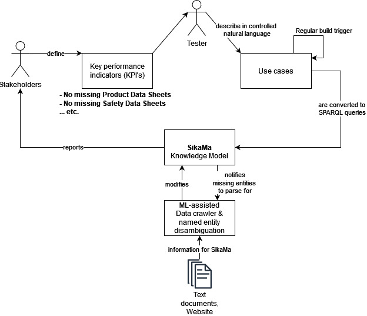

# SikaMa - Accurate and trustworthy information for Sika
A SIKA wide knowledge hub to overcome information barriers, with accurate and trustworthy information.

## Why is SikaMa necessary?
Imagine actively taking steps to reduce information gaps, without having to hunt for every last inefficiency out there in your knowledge management. What if you could overcome organizational silos, one regular CI/CD build at a time?
So, instead of firefighting when inefficiencies and information gaps arise, you stay ahead of the digital transformation curve with SikaMa.

## How does SikaMa work?
1) Knowledge Representation and Reasoning forms the backbone of this knowledge management system. 
2) The various stakeholders define what gaps are unacceptable. The construction industry, which is still in the nascent stages of digitalization could be missing critical information, like the product heirarchy numbers of SIKA products. The formulation of the gaps are used as key performance indicators (KPI), which can be objectively measured and quantified.
2) The test engineer can then convert these gap formulations into test cases for

## What does SikaMa do?

# Working with the tool
## Usage using Jupyter
- Download [Anaconda](https://www.anaconda.com/)
- Then open this repo with **Jupyter**, then you will be able to interact with this AI Assistent.

## Dependencies to run sparqlQuery.py
- Install rdblib - "pip install rdblib". More information on rdblib can be found [here](https://rdflib.readthedocs.io/en/stable/apidocs/rdflib.html#rdflib.graph.Graph.query).
- It is suggested to run the code in virtual environment.

# Current limitations

# Future challenges and further research

# Sources
